# ML Workflow on Amazon SageMaker

The goal of this project is to:
1. Get images and labels from CIFAR ds using a GET request.
2. Filter the data out and split the data into training and testing
3. Train an image classification model to differentiate bicycles from motorcycles in 32x32 RGB images.
4. Deploy the model
5. Create a workflow to make inferences using Lambda and Step Functions while filtering out predictions below a threshold
6. Monitor the model and visualize predictons from captured data

## Get images and labels
Once the dataset is downloaded from cifar, we can unzip it and save the meta, test, and train data into datasets. 
The meta data contains information about the dataset itself such as image names, labels, etc. The test and train datasets contains the images for testing and trainng respectively.

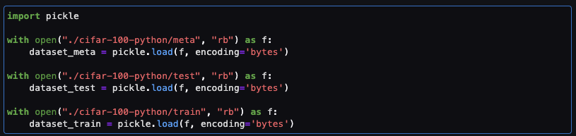

## Filter images

Only Bikes and Motorcyles images are going to be used for this purpose. This is why the rest of the images (not containing labels 8 nor 48) should be filtered out.

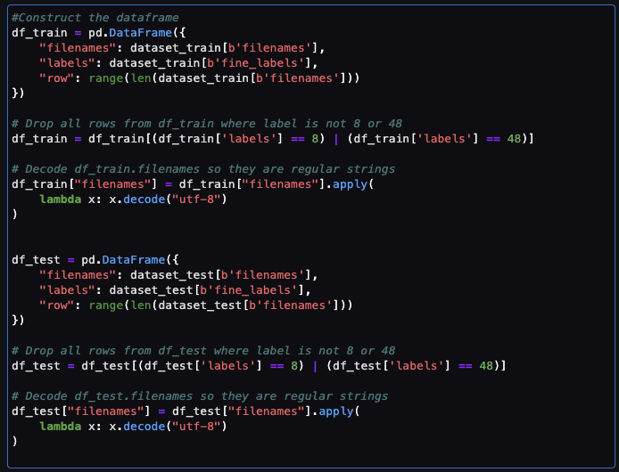

Once the images have been saved into our local directory we can transfer them into S3 in order to train the model.

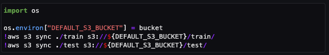

## Train model

Sagemaker expects metadata informaton for image classification such as path in S3 and label that is saved into `.lst` files that are going to be uploaded into S3 as well.

The `image-classification` algorithm by AWS is used in a GPU instance `ml.p2.xlarge` to be trained with our dataset. It is also important to mention that the image_shape should be 3x32x32 indicating 3 channels (RGB), and 32x32 size. The number of predicted classes are 2 (bike/motorcycle) and the number of training samples are 1000.

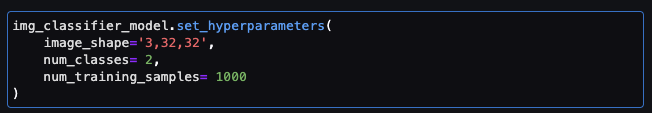

Once the model is trained using the `fit` method, it is ready to be deployed.

## Deploy model

Since we are interested in monitoring this model afterwards, it is important to set a `DataCaptureConfig` object with information about where we want to put the monitoring results for this model and finally use the deploy command together with the `DataCaptureConfig` object.

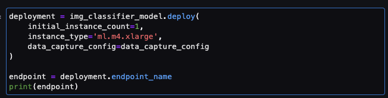

In case we stop the notebook instance, we can use the model saved in S3 to deploy it.

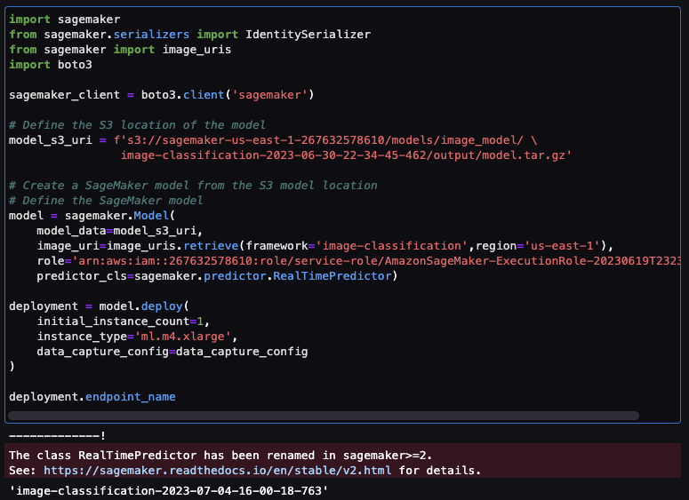

## Create a workflow to make inferences

Then we can create our lambda functions found in the `lambda_functions` directory. The accomplish diferent functions such as:
- serializer.py: serialize the image into base64 format
- inference.py: using the previously serialized image and the model endpoint make a prediction for such image
- threshold.py: if the prediction accuracy is less than .93 throw an error message.

This functions will be piped together using step functions.

## Pipeline

Using step functions, the individual lambda functions can be added into a workflow. If a prediction does not meet the threshold an error message is sent to a phone number using SNS Service. The SNS service needs to be configured before hand and a subscriber need to be created that will receive the error message. Any cell phone number can be added to it to receive the error message.

A successful prediction looks like this:

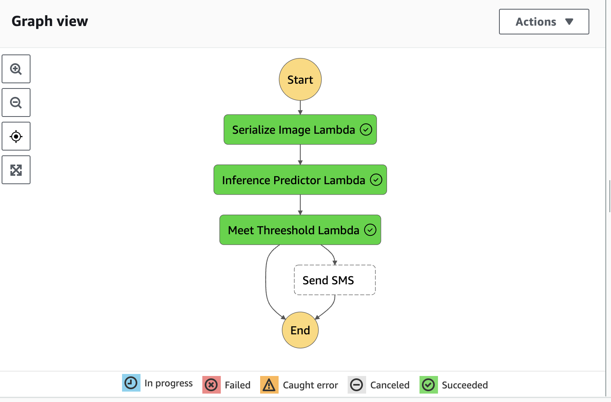

A failed prediction (not met the threshold) looks like this:

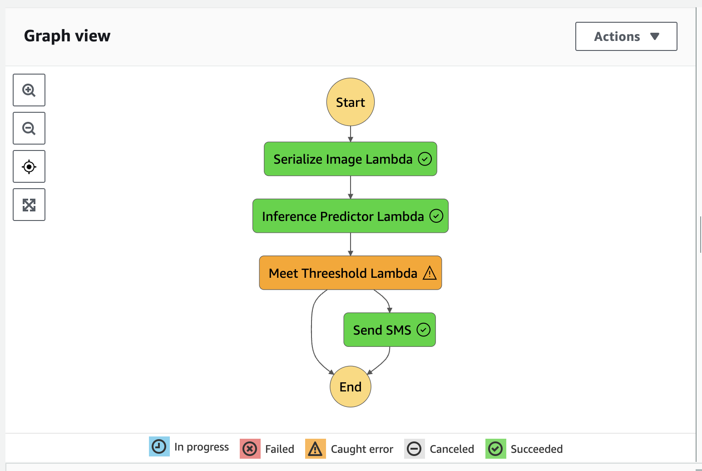

A complete description of the workflow can be found in the `workflow/step_functions_workflow.json` file.

## Monitor the Model
For this step it is needed to download the data from s3 directory that we configured previously to save the monitored data. 

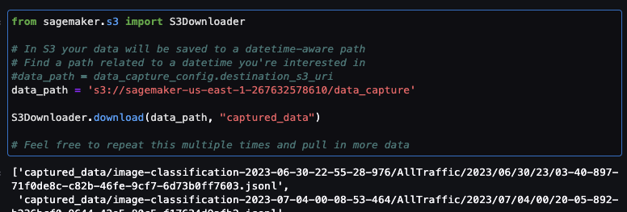

Then accessing the inferences made from the different executions of the workflow with several images accessing recursively the directory and searching for `.jsonl` lines such as:

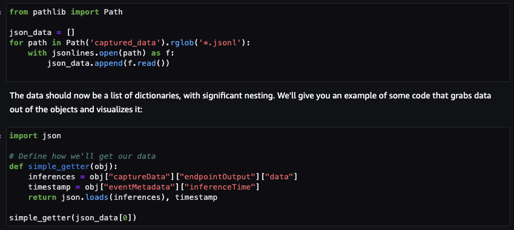

Using this data we can visualize what the accuracy of the predictions are and how many predictions we made for every class.

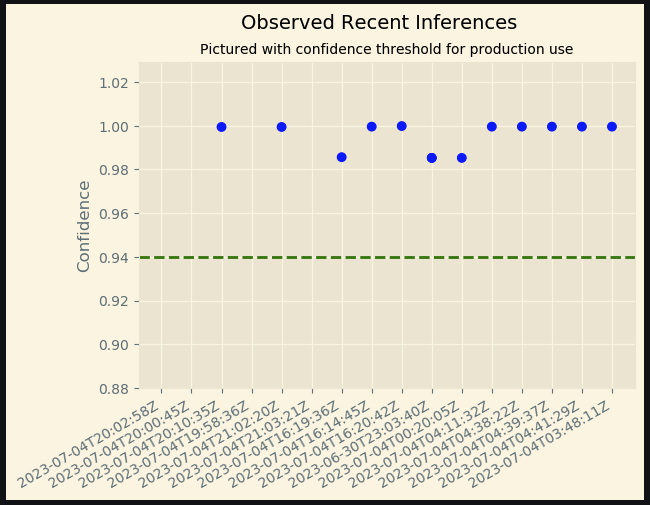
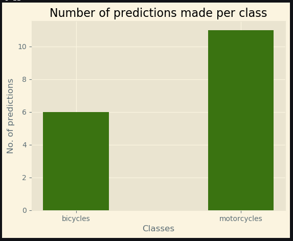

### That's it. Thanks!
